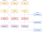

# Заметки 

## 1. Описание

### 1.1 Цель создания приложения

Приложение написано после прочтения статьи на
Хабре : [Чистая Архитектура для веб-приложений](https://habr.com/ru/post/493430/) 
.

Захотелось попробовать чистую архитектуру в действии.

В данном репозитории используется фреймворк Vue .

Также приложение реализовано на фреймворках React  и
Angular  (в других моих репозиториях).

### 1.2 Про приложение

Само приложение представляет собой SPA  приложение для заметок.

Каждая заметка имеет название и список задач. Каждая
задача имеет текст и чекбокс, говорящий о её завершённости.

На главной странице показано количество заметок.

На странице "Все заметки" показан список всех заметок. У каждой заметки показано только 3 первые задачи. Можно открыть
заметку и посмотреть все задачи в ней.

На странице "Новая заметка" можно создать заметку: ввести заголовок заметки, добавить задачи, ввести их заголовки и их
статус - завершённые или нет.

Также заметку можно отредактировать, изменяя данные в ней. При сохранении изменений или удалении заметки появляется
модальное окно с подтверждением действия.

Заметки сохраняются в Local Storage браузера.

Также при создании новой заметки или редактировании существующей имеется возможность выполнить отмену/повтор последних
действий.

### 1.3 Стили

Для стилизации используется библиотека Bootstrap .

### 1.4 Язык программирования

Приложение написано на языке Typescript .

### 1.5 Фреймворк

Фронтенд-фреймворк - React .

## 2. Настройка приложения с нуля 

### 2.1 Создать папку **todos_react**

### 2.2 Создать приложение vue

* **vue create todos_vue**

### 2.3 Установить зависимости

* **npm i -D prettier** 
* **npm i -D eslint-config-prettier eslint-plugin-prettier** 

* **npm i -D @types/node**

* **npm i bootstrap@5.3.0-alpha1**
* **npm i bootstrap-icons**

* **npm i first-di**
* **npm i class-validator**
* **npm i reflect-metadata**
* **npm i ts-serializable**
* **npm i typeorm**

* **npm i axios**

* **npm i -D @babel/plugin-proposal-decorators @babel/plugin-proposal-class-properties**
* **npm i -D @vue/babel-plugin-jsx**
* **npm i vue-property-decorator**

### 2.4 Добавить в файл .eslintrc.js:

```
module.exports = {
  "root": true,
  "extends": [
    "eslint:recommended",
    "plugin:vue/vue3-essential",
    "@vue/typescript/recommended",
    "plugin:prettier/recommended",
    "prettier",
  ],
}
```

### 2.5 Добавить в файл .prettierrc:

```
{
  "semi": true,
  "trailingComma": "none",
  "singleQuote": false,
  "printWidth": 80,
  "tabWidth": 2,
  "useTabs": false,
  "arrowParens": "avoid"
}
```

### 2.6 В файле babel.config.js включить:

```
module.exports = {
    presets: ["@vue/cli-plugin-babel/preset"],
    plugins: [
        ["@babel/proposal-decorators", { legacy: true }],
        ["@babel/proposal-class-properties", { loose: true }],
        ["@vue/babel-plugin-jsx"]
    ]
};
```

### 2.7 В файле tsconfig.json включить:

```
{
  "compilerOptions": {
    "emitDecoratorMetadata": true, // Позволяет генерировать рефлексию
  }
}
```

### 2.8 В IDE  включить опции:

#### Settings/Languages & Frameworks/Javascript/Prettier:

* Prettier package: выбрать текущий каталог - **...\node_modules\prettier**
* поставить галочку - **On 'Reformat Code' action**
* поставить галочку - **On save**

#### Settings/Tools/Action on Save:

* поставить галочку - **Reformat code**
* поставить галочку - **Run eslint --fix**

### 2.9 Создать файл ./src/main.css.

### 2.10 Добавить в файл ./src/main.ts:

```
import "bootstrap/dist/css/bootstrap.min.css";
import "bootstrap/dist/js/bootstrap.min.js";
import "bootstrap-icons/font/bootstrap-icons.css";
import './main.css';
```
